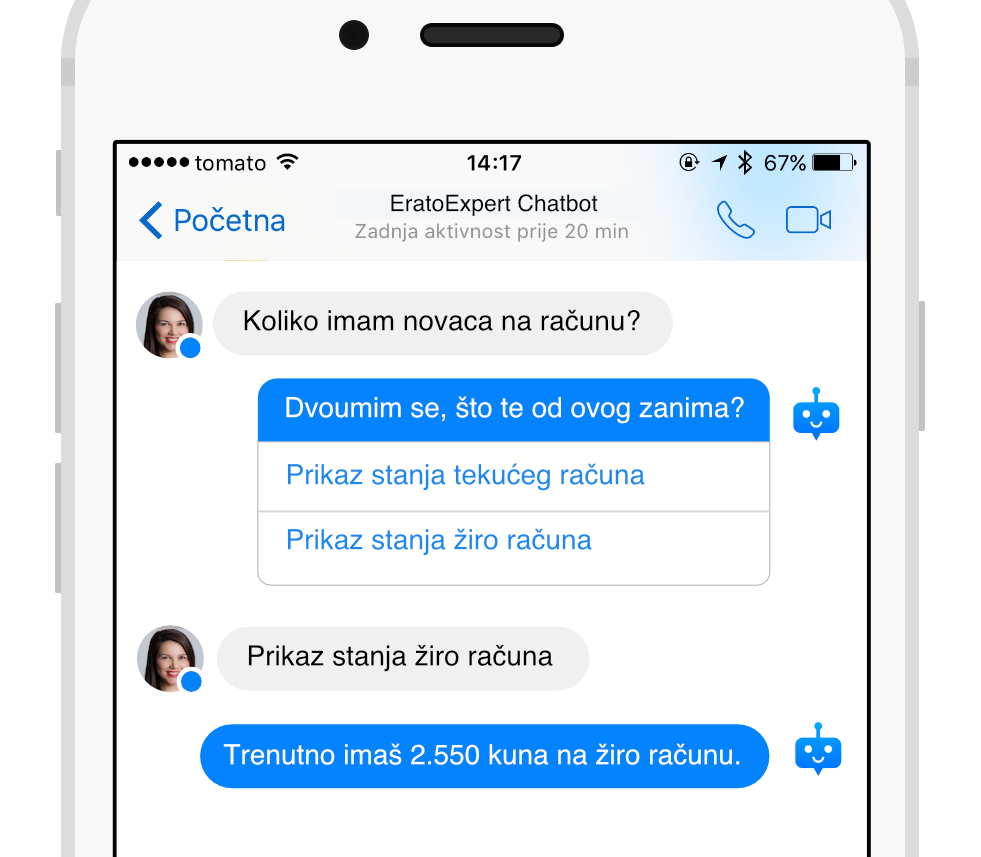
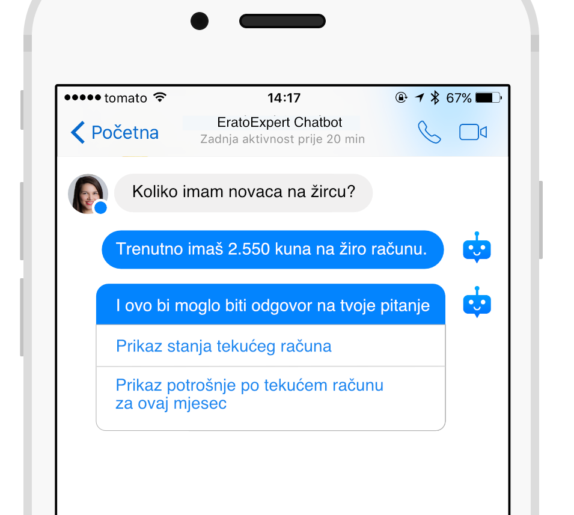
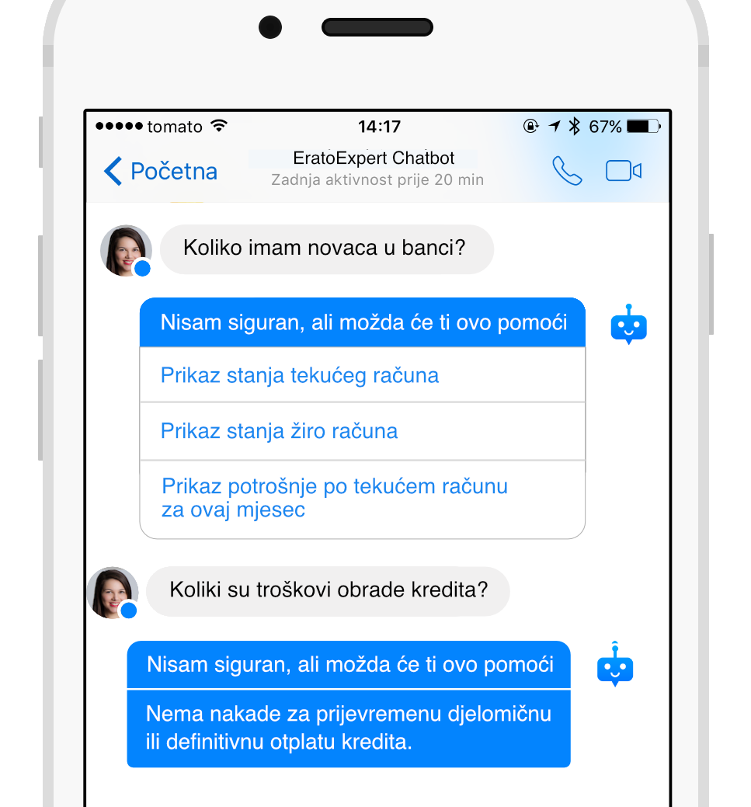
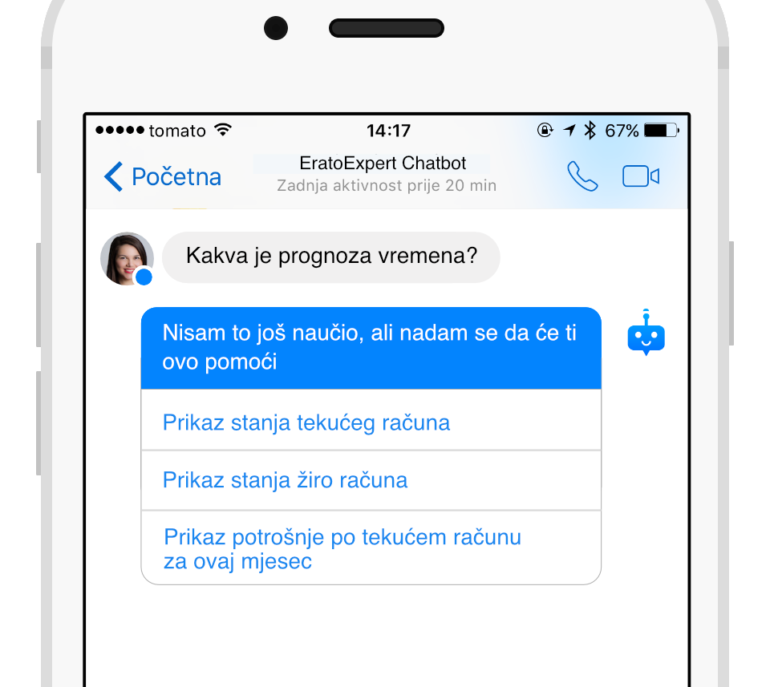
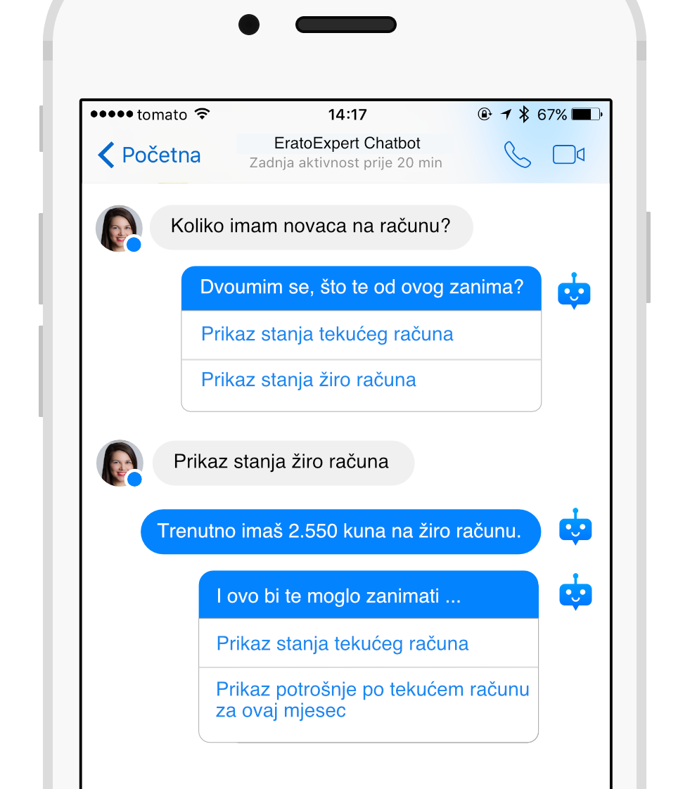

## Preporuke za stvaranje dobrog korisničkog iskustva

EratoExpert može vratiti top N (default 3) odgovora. Može vratiti manje ako je prepoznata sigurnost drugih odgovora jednaka 0.
Svaki odgovor ima pridijeljenu “sigurnost” (“certainty” key u JSON-u) koja predstavlja sigurnost sustava da je dani odgovor točan - postotak od 0 do 100, decimalni broj.

**Vrijednosti pragova** mogu se postaviti na stranici postavki projekta u developerskoj konzoli. Vrijednosti se vraćaju kroz API bez promjena na execution serveru.
Pragovi se mogu koristiti u klijentskoj aplikaciji koja se koristi EratoExpert API-jem radi upravljanja iskustvom korisnika s obzirom na "osjetljivost" određivanja sigurnosti za svaki odgovor koji stigne povratno na upit s EratoExpert execution servera.

Postoje tri vrijednosti praga koje možete postaviti:

 * `pozitivan` - Ako je sigurnost odgovora viša od ovog praga, smatrajte ga točnim odgovorom.
 * `negativan` - Ako je sigurnost odgovora niža od ovog praga, smatrajte ga netočnim odgovorom.
 * `razlikovni` - Ako je razlika postotka točnosti dvaju ili više odgovora unutar ove vrijednosti, ponudite korisniku opciju odabira točnog odgovora.

S obzirom na to da ćete vi unositi odgovore i akcije za svoj projekt, najbolje znate koliko "slični" odgovori mogu biti pa ćete ove parametre vjerojatno morati prilagoditi kako biste što bolje upravljali prikazom odgovora u svojoj aplikaciji.

Na temelju ovih pragova nekoliko je kombinacija odgovora s pripadajućim postocima sigurnosti koje biste krajnjem korisniku trebali prikazati na različite načine radi optimizacije iskustva krajnjeg korisnika.

#### Upravljanje korisničkim iskustvom

Krenimo s **"razlikovnim"** pragom.

Ako se dva ili više najbolje ocijenjenih odgovora nalaze unutar ovog praga (vrijednost = najveći postotak sigurnosti - drugi najveći postotak sigurnosti; vrijednost < razlikovni prag), korisniku trebate ponuditi mogućnost odabira pravog odgovora uz uvodnu rečenicu poput ove: 
> "Dvoumim se, što te od ovoga zanima?"

nakon čega bi uslijedila lista ID-eva svih odgovora unutar tog "razlikovnog" praga koje korisnik može kliknuti i dobiti potpuni tekst tog odgovora.

&nbsp;

Ako se najbolje ocijenjeni odgovor i drugi najbolje ocijenjen odgovor ne nalaze unutar razlikovnog praga, sljedeći korak ovisi o rangu sigurnosti tih odgovora:

 1. Ako je "top" odgovor pozitivan, tj. ako je sigurnost odgovora s najvećim postotkom iznad pozitivnog praga, treba prikazati putpuni tekst tog top odgovora. 
    Ako postoji još odgovora koji su u pozitivnom području, nakon prikaza top odgovora prikazati i druge odgovore iz pozitivnog i srednjeg područja u listi sa uvodnom rečenicom poput:
    > "I ovo bi moglo biti odgovor na tvoje pitanje"
    
               

 2. Ako je "top" odgovor između pozitivnog i negativnog praga, prikazati uvodnu rečenicu:
    > "Nisam siguran, ali možda će ti ovo pomoći..."
    
    Pa ovisno o tome ima li drugih odgovora unutar tog raspona:

    * Ako postoji još odgovora unutar tog ranga, prikazati listu ID-eva odgovora koje korisnik može kliknuti i dobiti potpuni tekst tog odgovora.

    * Ako nema drugih odgovora, prikažite puni tekst odgovora.

    

 3. Ako su svi odgovori ispod negativnog praga, prikazati ID-eve tih odgovora u listi uz uvodnu rečenicu poput:
    > "Nisam to još naučio, ali nadam se da će ti ovo pomoći..."

    

Nakon što je korisniku prikazan potpuni tekst odgovora (bilo odmah bilo odabirom odgovora iz liste), a postoji još drugih odgovora vraćenih kroz API, prikažite mu i listu ID-eva svih drugih odgovora i eventualno dodajte rečenicu poput:
   > "Moglo bi te i ovo zanimati..."

   

<!-- Repetitive ... ? -->

